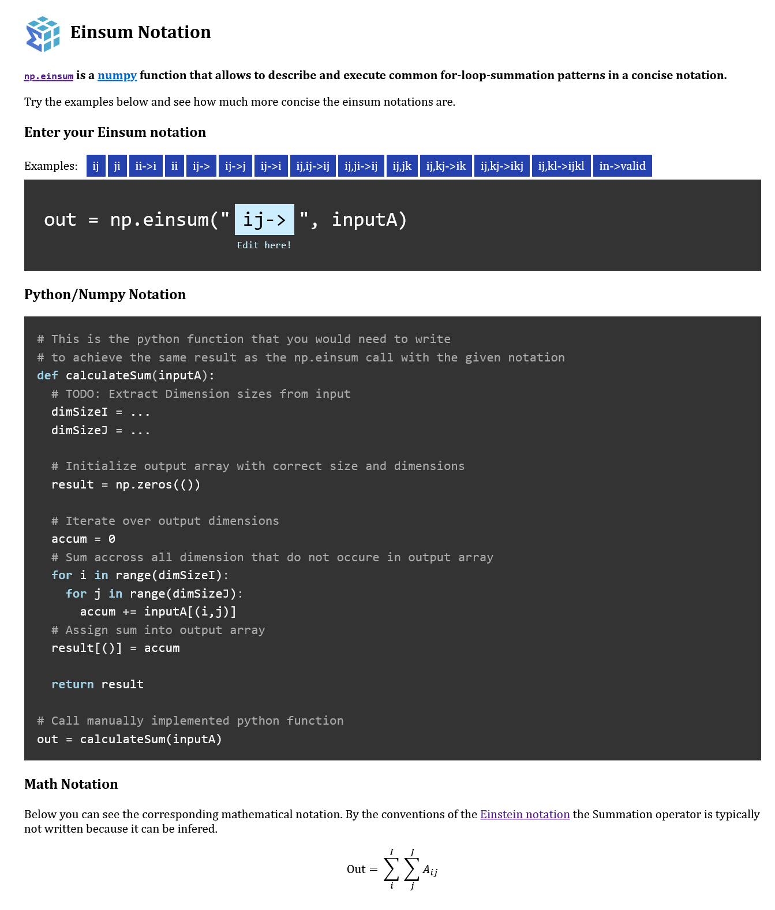

# Einsum Notation

[Live demo](https://static.laszlkorte.de/einsum)

`np.einsum` is a numpy function that allows to describe and execute common for-loop-summation patterns in a concise notation.

When working with multidimensional arrays a very common calculation is to multiply elements of multiple arrays together and optionally sum the results along a dimension. A few examples for such kind of operation are the dot-product, the vector-matrix-product, or the outer product.

For many of these operations libraries like numpy provide individual implementations. For multiplying two matrices for example it is not necessary to manually iterate over the rows and columns of the matrices, but instead np.matmul(A,B) can be used. The advantage is both a higher level of abstraction and the opportunity to rely on internal optimazations of the math library, in this case numpy.

But only some of these array operations are common enough that they have a proper name and are provided by a math library. Sometimes a more specific kind of operation is needed to combine multiple arrays. In such a case it might be necessary to fall back to hand written loops. Or not!

Einsum is a domain specific language (DSL) that allows to express a specific class of common array iteration patterns in a concise way. It in inspired by the Einstein notation, hence the name. [There exist][1] [already plenty][2] [of excellent][3] and detailled explanations of einsum online. This tool contributes by providing an interactive approach to convert einsum notation into the corresponding python code.

[1]: https://ajcr.net/Basic-guide-to-einsum/
[2]: https://rockt.github.io/2018/04/30/einsum
[3]: https://obilaniu6266h16.wordpress.com/2016/02/04/einstein-summation-in-numpy/